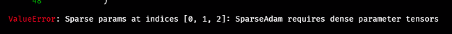

# Course Applied Deep Learning with TensorFlow and PyTorch

## Implementation of Top-K Always Sparse Training in Pytorch

This repository is going to contain a package for an implementation of [Top-KAST: Top-K Always Sparse Training](https://arxiv.org/abs/2106.03517v1). Top-KAST is a generic method to train fully sparse neural networks. We follow the original ideas from the authors' Top-KAST paper as closely as possible.

### Top-K Layers

Selecting the active parameter subset is done by identifying the Top-K biggest weights per layer (by either Euclidean or absolute-vale norm). We provide a sparse adaptation for an nn.Linear module. Other types of layers may be added later on.

### Testing

Testing is carried out by training on a synthetic example (tbd) and the Boston housing data set

### Example

tbd.

### Benchmarks

We compare runtimes and VRAM usage to demonstrate the benefits of our implementation. Not finished yet. A comparison for simple vanilla networks may follow.
### Dependencies

- Python >=3.7 
- NumPy >= 1.19.5
- PyTorch >= 1.8.1
- pytorch-sparse >= 0.6.11 (https://github.com/rusty1s/pytorch_sparse)

## Installation

Local installation:
1. Clone this repository.
2. Install pytorch_sparse according to your specifications (https://github.com/rusty1s/pytorch_sparse).
3. Set working directory to where the repository has been copied to (`cd appl_deepl`).
4. Run `pip install .` .